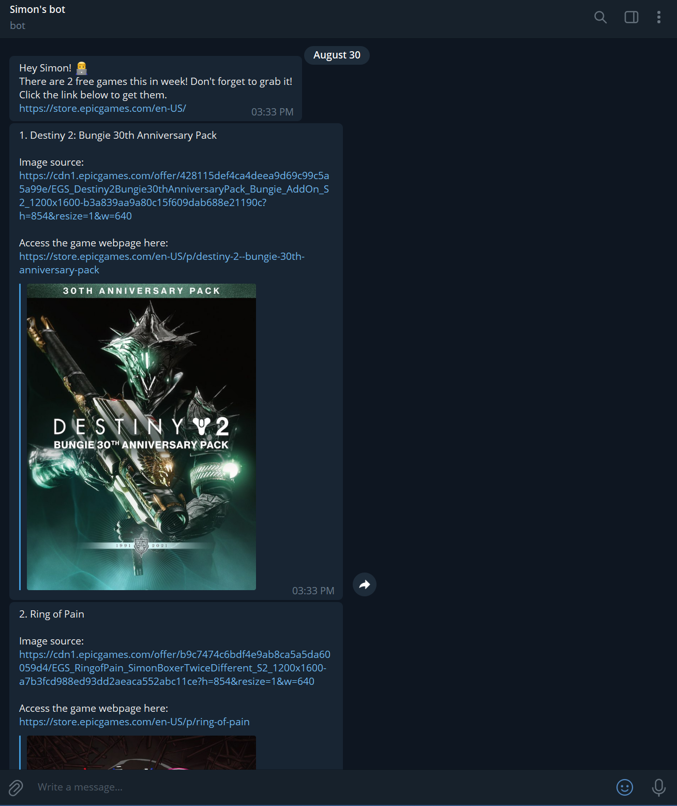

# Epic-Game-Store-Free-Game-Notification

## Feature
This program will scrape the free game information from Epic game store website then send you the free game of this week via Telegram bot.

## How to use it. 
1. In order to send the notification to your own bot, you need to configure the Telegram bot. Read this link for the details. [Telegram-Bot-Push-Message](https://github.com/simonnchong/Telegram-Bot-Push-Message). If you don't wanna use Telegram bot, you may use Whatsapp, email, message or any other playforms. 

2. You have to download the webdriver to make your Python program to control web browser. NOTE: Please download it according to your web browser version.
- [Google Chrome Webdriver](https://chromedriver.chromium.org/downloads)
- [Firefox Webdriver](https://github.com/mozilla/geckodriver/releases/)
- [Microsoft Edge Webdriver](https://developer.microsoft.com/en-us/microsoft-edge/tools/webdriver/)

Once you've done the the 2 steps of configuration, you may try to run this code in your ideal IDE/text editor.
In order to have a better experience, you may host your code in somewhere else to keep it executing for 24/7.

## Sample result
The name and the thumbnail of the games will be sent to your Telegram.

